# Live Enhancement Suite Custom — ユーザマニュアル

> LESforMacOS Custom のユーザ向け操作マニュアルです。
> インストールから全機能の使い方までを解説します。

## 目次

- [全体の流れ](#全体の流れ)
- [インストール](#インストール)
- [基本操作](#基本操作)
- [キーボードショートカット一覧](#キーボードショートカット一覧)
- [プラグインメニュー](#プラグインメニュー)
- [ピアノロールマクロ](#ピアノロールマクロ)
- [VST ショートカット](#vst-ショートカット)
- [プロジェクト時間トラッキング](#プロジェクト時間トラッキング)
- [メニューバー](#メニューバー)
- [設定リファレンス](#設定リファレンス)
- [設定ファイルの場所](#設定ファイルの場所)
- [プラグインお気に入り](#プラグインお気に入り)
- [プロジェクトメモ](#プロジェクトメモ)
- [macOS 通知連携](#macos-通知連携)
- [ショートカット一覧オーバーレイ](#ショートカット一覧オーバーレイ)
- [AI 機能](#ai-機能)
  - [AI チャットアシスタント](#ai-チャットアシスタント)
  - [AI プラグイン提案](#ai-プラグイン提案)
  - [AI プロジェクト名提案](#ai-プロジェクト名提案)
  - [AI プロジェクトメモ要約](#ai-プロジェクトメモ要約)
- [トラブルシューティング](#トラブルシューティング)
- [イースターエッグ](#イースターエッグ)

---

## 全体の流れ

LES が Ableton Live と連携する仕組みの全体像です。

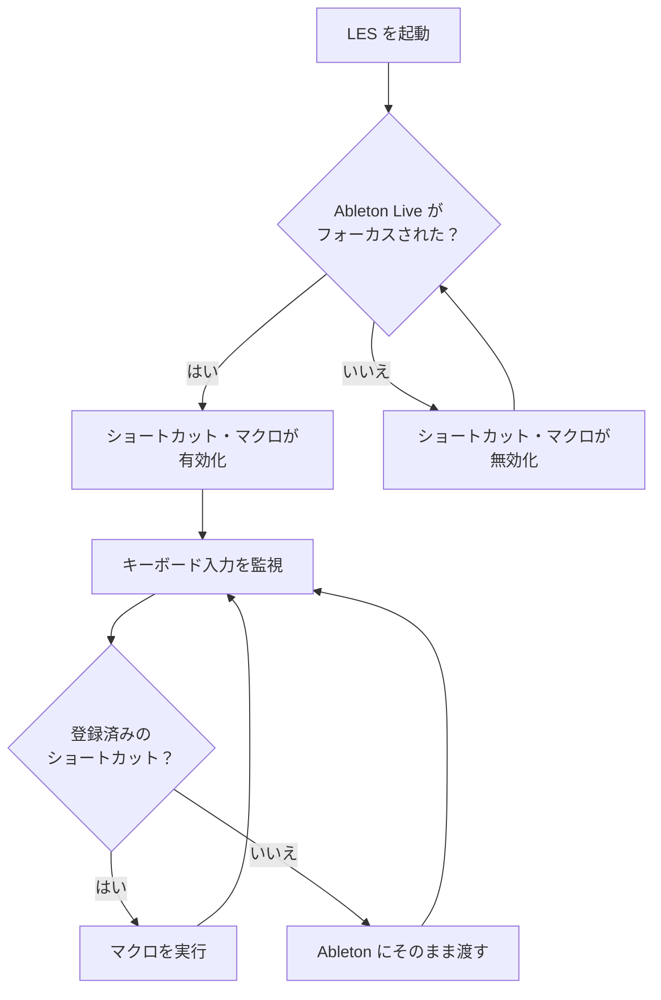

---

## インストール

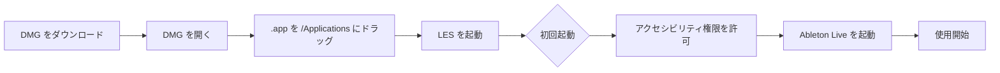

### 動作要件

| 項目 | 要件 |
|------|------|
| macOS | 12 (Monterey) 〜 15 (Sequoia) |
| Ableton Live | 9 〜 12 |

### 手順

1. [最新リリース](https://github.com/bassmicrobe/LESforMacOSCustom/releases/latest)から `LiveEnhancementSuiteCustom.dmg` をダウンロード
2. DMG を開き、`Live Enhancement Suite Custom.app` を `/Applications` にドラッグ
3. アプリを起動
4. **システム設定 → プライバシーとセキュリティ → アクセシビリティ** で LES を許可
5. Ableton Live を起動すると、LES が自動的にショートカットを有効化

---

## 基本操作

LES は Ableton Live がフォーカスされている間だけ動作します。他のアプリに切り替えると自動でショートカットが無効化されます。

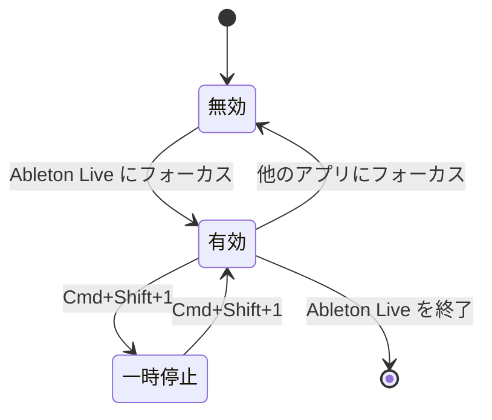

| 操作 | 説明 |
|------|------|
| Ableton にフォーカス | 全ショートカットが自動で有効化 |
| 他のアプリにフォーカス | 全ショートカットが自動で無効化 |
| `Cmd+Shift+1` | LES のショートカットを一時停止/再開 |

---

## キーボードショートカット一覧

### メインショートカット

| ショートカット | 機能 | 説明 |
|---------------|------|------|
| `Cmd+Shift+H` | プラグインメニュー | カスタムプラグインメニューを表示 |
| `Cmd+B` | Buplicate | クリップを複数回複製（初回7回、以降8回） |
| `Cmd+Shift+M` | MIDIクリップ作成 | 新規MIDIクリップを作成 |
| `Cmd+Alt+S` | バージョン保存 | プロジェクトを新バージョンとして保存 |
| `Alt+L` | マーカー作成 | 現在位置にロケーターマーカーを追加 |
| `Cmd+W` | ウィンドウを閉じる | フォーカス中のウィンドウを閉じる |
| `Cmd+Alt+W` | 全ウィンドウを閉じる | メインウィンドウ以外を全て閉じる |
| `Cmd+Shift+1` | 一時停止 | LES の全ショートカットを一時停止/再開 |
| `Cmd+Shift+/` | ショートカット一覧 | 全ショートカットをオーバーレイ表示 |
| `Cmd+Shift+A` | AI アシスタント | AI チャットウィンドウの表示/非表示 |

### 編集ショートカット

| ショートカット | 機能 | 設定依存 |
|---------------|------|---------|
| `Cmd+Alt+D` | 絶対複製 | `ctrlabsoluteduplicate=0` の場合 |
| `Cmd+Ctrl+D` | 絶対複製 | `ctrlabsoluteduplicate=1` の場合 |
| `Cmd+Alt+V` | 絶対置換 | `absolutereplace=1` の場合 |
| `0` `0`（素早く2回） | 削除キー | `double0todelete=1` の場合 |

### トラック操作

| ショートカット | 機能 |
|---------------|------|
| `Alt+G` | 中クリックエミュレーション |
| `Alt+E` | エンベロープモード |
| `Alt+X` | トラッククリア |
| `Alt+C` | トラック色変更 |

---

## プラグインメニュー

お気に入りのプラグインをカテゴリ分けして素早くアクセスできます。

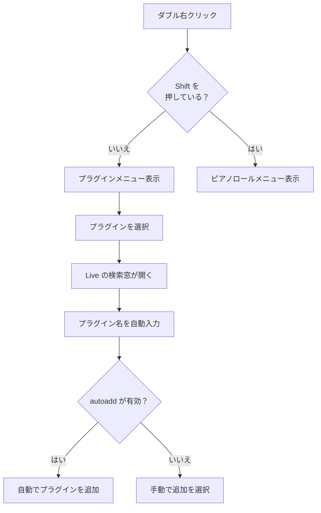

### 使い方

1. Ableton Live 上で**ダブル右クリック**
2. カテゴリを辿ってプラグインを選択
3. Live の検索窓が開き、プラグイン名が自動入力される
4. `autoadd=1` の場合、自動的にトラックに追加される

### Cmd キーの反転動作

プラグイン選択時に `Cmd` を押しながらクリックすると、`autoadd` 設定が一時的に反転します：
- `autoadd=1` の場合 → Cmd で自動追加を**スキップ**
- `autoadd=0` の場合 → Cmd で自動追加を**実行**

### メニューのカスタマイズ

`~/.les/menuconfig.ini` を編集してプラグインメニューの内容を変更できます。

```ini
; コメント行（表示されない）
/カテゴリ名
プラグイン名1
プラグイン名2
—                    ; 区切り線
//サブカテゴリ名
プラグイン名3
..                   ; 1つ上の階層に戻る
/nocategory          ; ルート階層に戻る
```

例：

```ini
/EQ
Pro-Q 3
Channel EQ
—
//ダイナミックEQ
Soothe 2
..
/Compressor
Pro-C 2
Glue Compressor
/nocategory
OTT
```

変更後、メニューバーの **Reload** で反映されます（または `dynamicreload=1` で自動反映）。

### プラグインスキャン（自動カテゴリ分類）

メニューバーの **Scan Plugins...** でインストール済みプラグインを自動検出・分類できます。

#### 仕組み

1. **Audio Units**: `system_profiler SPAudioDataType` でプラグイン名とタイプ（Effect / Music Device）を取得
2. **VST3**: `/Library/Audio/Plug-Ins/VST3/` と `~/Library/Audio/Plug-Ins/VST3/` の `.vst3` バンドル内 `moduleinfo.json` からサブカテゴリを取得
3. **キーワードヒューリスティック**: プラグイン名からカテゴリを推測（例: "Pro-C" → Compressor）

#### 分類されるカテゴリ

| カテゴリ | 例 |
|---------|-----|
| Instruments | Serum, Massive |
| Synthesizer | Analog, Wavetable |
| Sampler | Simpler, Kontakt |
| Compressor | Pro-C 2, Glue Compressor |
| EQ | Pro-Q 3, EQ Eight |
| Reverb | Valhalla Room, Hybrid Reverb |
| Delay | Echo, H-Delay |
| Distortion | Saturator, Decapitator |
| Modulation | Chorus-Ensemble, Phaser-Flanger |
| Pitch | Auto-Tune, Pitch Hack |
| Utility | Utility, Tuner, Spectrum |
| MIDI Effect | Arpeggiator, Chord |

#### インクリメンタルスキャン

2 回目以降のスキャンは **差分検出** で効率的に動作します。

- 初回: フルスキャンを実行し、結果を `~/.les/resources/plugin_cache.json` にキャッシュ
- 2 回目以降: 現在のプラグインとキャッシュを比較し、**新規追加** と **削除済み** のみを検出
- 新規プラグインは既存の `menuconfig.ini` の末尾（`End` マーカーの前）に追記され、ユーザーの手動編集は保持される
- 削除済みプラグインは通知のみ（`menuconfig.ini` からの自動削除はしない）

#### 使い方

1. メニューバー → **Scan Plugins...** （差分スキャン。初回はフルスキャン）
2. 検出されたプラグイン数とカテゴリ数が表示される
3. 新規プラグインがあれば `menuconfig.ini` に追記される
4. 自動的に Reload されメニューに反映

**Force Full Rescan...** を選択すると、キャッシュをクリアしてフルスキャンを実行します。`menuconfig.ini` のバックアップ後、全件で再生成されます。

バックアップは `~/.les/menuconfig_[timestamp].ini` に保存されます。

### プラグイン検索 UI（Chooser）

メニューバーの **Search Plugins...** から Spotlight 風の検索 UI を開きます。

#### カテゴリフィルタ

1. 検索 UI を開く
2. 先頭の **📂 カテゴリ絞込** を選択
3. カテゴリ一覧から選択すると、そのカテゴリのプラグインのみ表示
4. **すべて表示** でフィルタを解除

カテゴリは `menuconfig.ini` の `/カテゴリ名` 構文に基づきます。

#### ソート

1. 検索 UI を開く
2. 先頭の **⚙ ソート変更** を選択
3. ソート方法を選択：

| ソート | 説明 |
|--------|------|
| 名前順 (A→Z) | アルファベット順（デフォルト） |
| 使用頻度順 | よく使うプラグインが上位 |
| 最終使用日時順 | 最近使ったプラグインが上位 |
| 追加日時順 | 新しく追加されたプラグインが上位 |

#### 使用統計

プラグインを使用するたびに以下が自動記録されます：

- **使用回数** — プラグインの累計使用回数
- **最終使用日時** — 最後に使った日時
- **追加日時** — 初めて使用した日時

統計データは `~/.les/resources/plugin_stats.json` に保存されます。検索 UI のサブテキストにも表示されます。

---

## ピアノロールマクロ

ピアノロール内でのノート操作を効率化します。

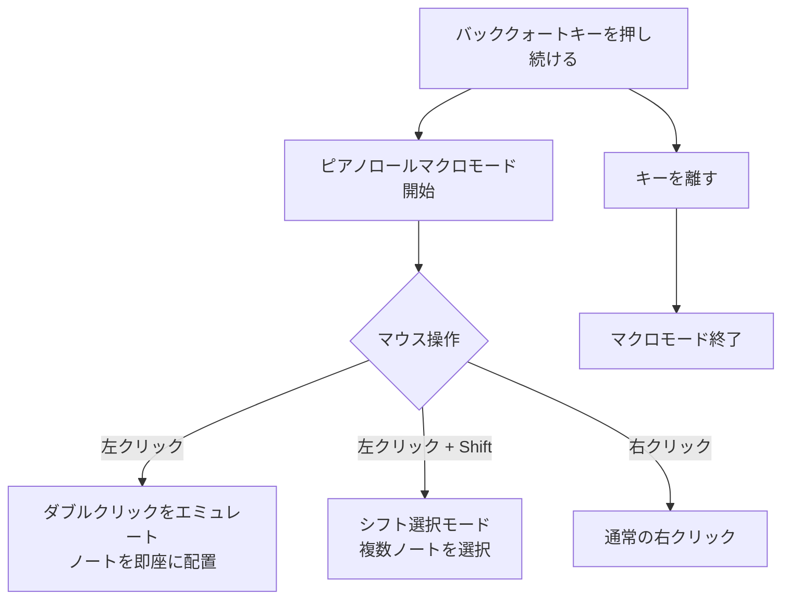

### 使い方

1. ピアノロールビューを開く
2. バッククォートキー（`` ` ``）を**押し続ける**
3. 左クリックするとダブルクリックが自動実行され、素早くノートを配置できる
4. `Shift` を併用すると選択モードになる
5. キーを離すとマクロモード終了

### スケール・コードメニュー

ダブル右クリック + `Shift` でスケール/コードメニューが表示されます。

**スケール（一部）：**

| カテゴリ | スケール |
|---------|---------|
| 基本 | Major, Minor, Harmonic Minor, Melodic Minor |
| モード | Dorian, Phrygian, Lydian, Mixolydian, Locrian |
| ペンタトニック | Major Pentatonic, Minor Pentatonic, Blues |
| ワールド | Arabic, Gypsy, Hirajoshi, In-Sen, Pelog |

**コード：**

Major, Minor, Maj7, Min7, Maj9, Min9, 7th, Augmented, Diminished, Power Chord, Octaves

---

## VST ショートカット

特定の VST プラグインウィンドウがフォーカスされている場合に有効になります。

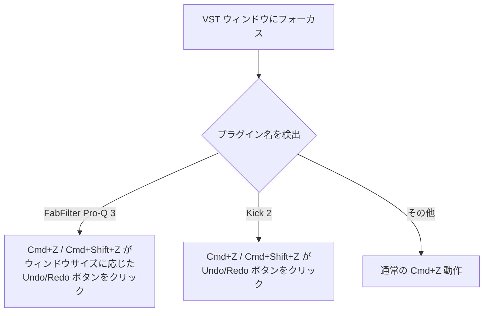

### 対応プラグイン

| プラグイン | Cmd+Z | Cmd+Shift+Z | 補足 |
|-----------|-------|-------------|------|
| **FabFilter Pro-Q 3** | Undo | Redo | ウィンドウサイズに応じてクリック位置を自動計算 |
| **Kick 2** | Undo | Redo | ウィンドウ幅の比率でボタン位置を計算 |

`vstshortcuts=0` で無効化できます。

---

## プロジェクト時間トラッキング

各プロジェクトの作業時間を自動で記録します。

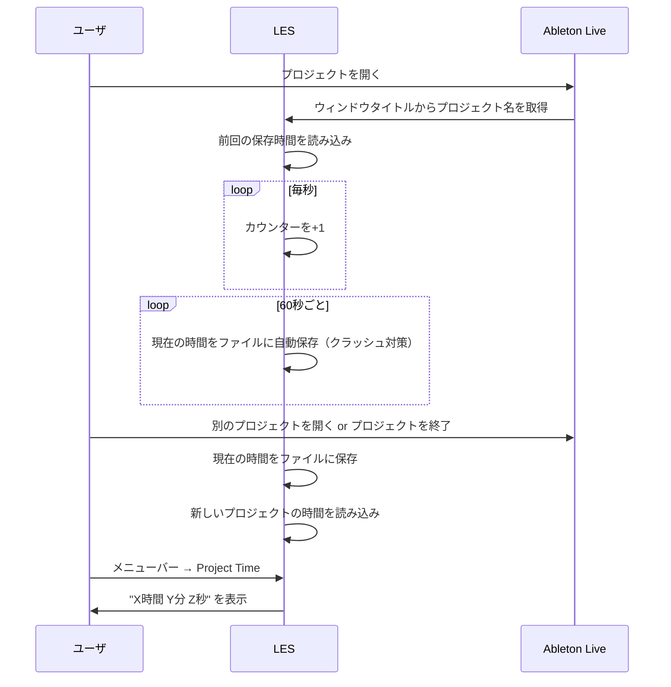

### 機能

- **自動記録**: Ableton Live がフォーカスされている間、毎秒カウント
- **プロジェクト別**: ウィンドウタイトルからプロジェクト名を自動検出して個別に記録
- **永続保存**: `~/.les/resources/time/` にプロジェクトごとのファイルで保存。60秒ごとに自動フラッシュするため、クラッシュ時も最大 60 秒分のみ損失
- **確認方法**: メニューバーアイコン → **Project Time** をクリック
- **リセット**: Project Time ダイアログで「Reset」を選択（その場でカウンターと保存ファイルを 0 にリセット）

### Strict Time モード

メニューバーの **Strict Time** にチェックを入れると：
- Ableton Live からフォーカスが外れた時にタイマーを**停止**
- フォーカスが戻った時にタイマーを**再開**

チェックを外すと、フォーカスに関係なくタイマーが動き続けます。

---

## メニューバー

macOS メニューバー右上の LES アイコン（または "LES" テキスト）からアクセスします。

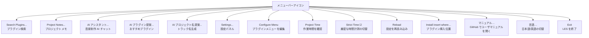

上図にない細かい項目もメニューに含まれます。

- **マニュアル** — 既定のブラウザで GitHub 上のユーザマニュアル（`develop` ブランチの `docs/USER_MANUAL.md`）を開きます:  
  `https://github.com/bassmicrobe/LESforMacOSCustom/blob/develop/docs/USER_MANUAL.md`
- **言語** — UI 表示言語を日本語と英語で切り替えます（切替後に LES が再読み込みされます）。
- **Install insert where…** — プラグインをブラウザから追加したときの挿入位置を指定します。
- **上流版（LESforMacOS）との違い** — メニューバーに **「寄付する」** はありません。Custom 版では PayPal 等の寄付メニュー項目を載せていません。

### デバッグモード（`enabledebug=1`）

追加メニュー項目：
- **Console** — Hammerspoon コンソールを開く
- **Restart** — LES を再起動
- **Open Hammerspoon Folder** — 設定フォルダを Finder で開く

---

## 設定リファレンス

`~/.les/settings.ini` で設定を変更できます。変更後は **Reload** で反映してください。

### スイッチ設定（0 = オフ / 1 = オン）

| 設定名 | デフォルト | 説明 |
|--------|-----------|------|
| `autoadd` | `1` | プラグイン選択時に自動追加 |
| `disableloop` | `1` | MIDIクリップ作成時にループを無効化 |
| `saveasnewver` | `1` | Cmd+Alt+S のバージョン保存を有効化 |
| `altgrmarker` | `1` | マーカーショートカットを Shift+L → Alt+L に変更 |
| `double0todelete` | `1` | 0キー2回押しで Delete キーを送信 |
| `absolutereplace` | `1` | 絶対複製・絶対置換を有効化 |
| `ctrlabsoluteduplicate` | `0` | 絶対複製を Cmd+Ctrl+D にマップ（動画編集ソフトとの競合回避） |
| `enableclosewindow` | `1` | Cmd+W によるウィンドウ閉じを有効化 |
| `vstshortcuts` | `1` | VST 固有ショートカットを有効化 |
| `dynamicreload` | `0` | プラグインメニューを開くたびに自動リロード |
| `texticon` | `0` | メニューバーアイコンの代わりに "LES" テキストを表示 |
| `addtostartup` | `0` | macOS ログイン時に LES を自動起動 |
| `launchwithlive` | `0` | Ableton Live の起動を検知して LES を自動起動（Launch Agent） |
| `enabledebug` | `0` | デバッグモードを有効化 |
| `checksanity` | `1` | macOS / Ableton Live のバージョン互換性チェック |
| `resettobrowserbookmark` | `0` | プラグイン追加後にブックマーク位置をクリック |
| `notifyexport` | `1` | エクスポート完了時に macOS 通知を表示 |
| `notifyhourly` | `1` | 1 時間ごとの作業時間通知を表示 |

### 値設定

| 設定名 | デフォルト | 型 | 説明 |
|--------|-----------|---|------|
| `pianorollmacro` | `` ` `` | キー名 | ピアノロールマクロのトリガーキー |
| `loadspeed` | `0.3` | 秒 | プラグイン自動追加までの待機時間 |
| `bookmarkx` | `500` | ピクセル | ブックマーク復帰クリックの X 座標 |
| `bookmarky` | `500` | ピクセル | ブックマーク復帰クリックの Y 座標 |
| `openaikey` | `未設定` | 文字列 | OpenAI API キー（AI 機能で使用） |
| `openaimodel` | `gpt-4o-mini` | 文字列 | OpenAI モデル名 |

---

## 設定ファイルの場所

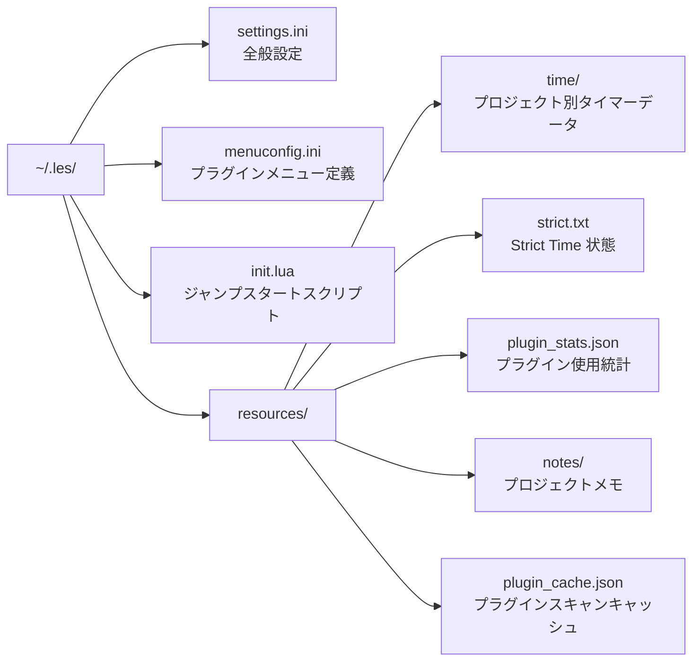

| ファイル | 用途 |
|---------|------|
| `~/.les/settings.ini` | 全般設定（ショートカットの有効/無効、動作パラメータ、API キー） |
| `~/.les/menuconfig.ini` | プラグインメニューの内容とカテゴリ構成 |
| `~/.les/resources/time/` | プロジェクト別の作業時間データ |
| `~/.les/resources/notes/` | プロジェクト別のメモデータ（JSON） |
| `~/.les/resources/plugin_stats.json` | プラグイン使用回数・お気に入り |
| `~/.les/resources/plugin_cache.json` | プラグインスキャンのキャッシュ |

---

## プラグインお気に入り

よく使うプラグインに★をつけて、検索 UI の上部に常に表示できます。

### 使い方

1. メニューバー → **Search Plugins...** で検索 UI を開く
2. 先頭の **⭐ お気に入り管理** を選択
3. プラグイン一覧が表示される（★ = お気に入り登録済み、☆ = 未登録）
4. プラグインをクリックすると★/☆をトグル

お気に入りに登録したプラグインは、検索 UI のメインリスト上部に「★」付きで表示されます。

データは `~/.les/resources/plugin_stats.json` の `favorited` フィールドに保存されます。

---

## プロジェクトメモ

プロジェクトごとにタイムライン形式のメモを記録できます。

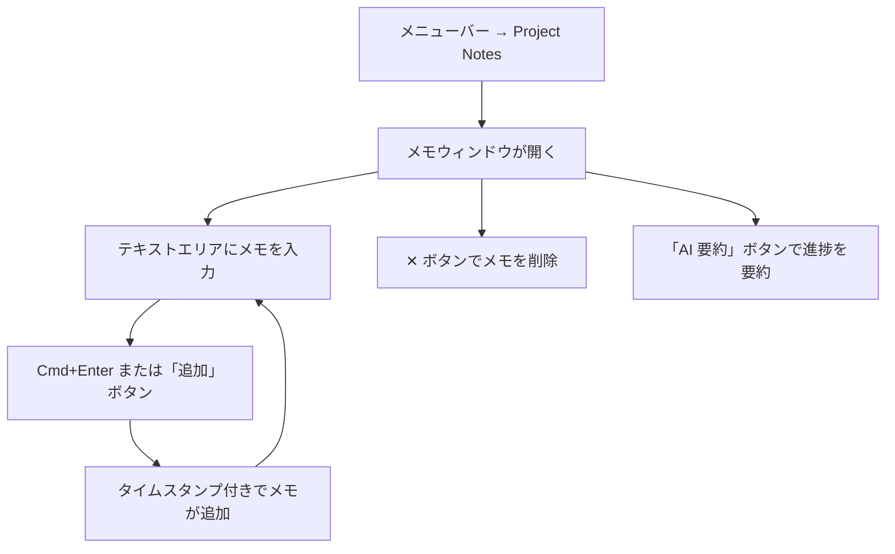

### 使い方

1. メニューバー → **Project Notes...** をクリック
2. テキストエリアにメモを入力し、**Cmd+Enter** または「追加」ボタンで追加
3. メモはタイムスタンプ付きで新しい順に表示される
4. 各メモの **✕** ボタンで個別削除（確認ダイアログあり）

### 特徴

- **プロジェクト別**: Ableton Live のプロジェクト名に紐づいて自動保存
- **タイムライン形式**: 日時付きで記録を振り返りやすい
- **永続保存**: `~/.les/resources/notes/[プロジェクト名].json` に保存
- **AI 要約**: 「AI 要約」ボタンで全メモの要約を自動生成（[AI 機能](#ai-機能)参照）
- **フローティング**: Ableton Live のフォーカスを奪わないウィンドウ

---

## macOS 通知連携

Ableton Live の作業状況に応じて macOS 通知センターに通知を表示します。

### エクスポート完了通知

Ableton Live でレンダリング/エクスポートが完了すると、通知が表示されます。

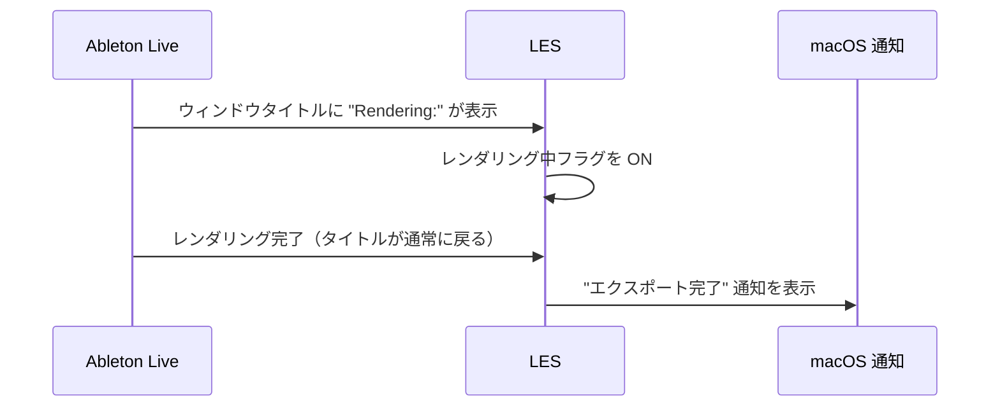

- 設定: `notifyexport`（デフォルト: ON）

### 1時間ごとの作業時間通知

プロジェクトのセッション時間が 1 時間の境界を超えるたびに通知します。

- 設定: `notifyhourly`（デフォルト: ON）
- プロジェクトを切り替えた場合、そのプロジェクトの既存時間から計算を開始（切り替え直後の即時通知はしない）

---

## ショートカット一覧オーバーレイ

`Cmd+Shift+/` で LES の全ショートカットをオーバーレイ表示できます。

- Ableton Live のフォーカスを奪わないフローティングウィンドウ
- 再度 `Cmd+Shift+/` を押すか、ウィンドウを閉じると非表示

---

## AI 機能

OpenAI API を利用した 4 つの AI 機能が利用できます。

### セットアップ

1. [OpenAI API キー](https://platform.openai.com/api-keys)を取得
2. メニューバー → **Settings...** → **AI 設定** セクション
3. **OpenAI API キー** にキーを入力
4. （任意）**AI モデル** を変更（デフォルト: `gpt-4o-mini`）
5. 「保存して再起動」をクリック

> **コスト目安**: `gpt-4o-mini` は非常に低コスト（1回の質問で約 $0.001 以下）。
> より高品質な回答が必要な場合は `gpt-4o` や `gpt-4.1-mini` に変更できます。

### AI チャットアシスタント

Ableton Live から離れずに音楽制作の質問ができるフローティングチャットウィンドウです。

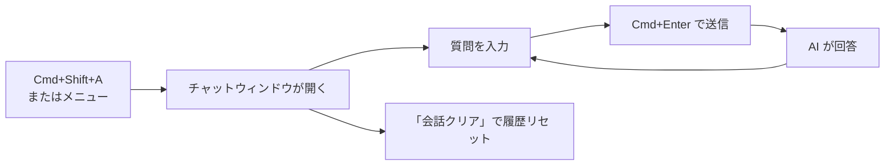

**起動方法**: `Cmd+Shift+A` / メニューバー → **AI アシスタント...**

**特徴**:
- 現在のプロジェクト名・セッション時間を自動でコンテキストに付与
- 会話履歴を保持（ウィンドウを閉じるまで）
- Ableton Live のフォーカスを奪わないフローティングウィンドウ

**質問例**:
- 「サイドチェインコンプの設定方法は？」
- 「Lo-Fi ヒップホップに合うコード進行を教えて」
- 「Pro-Q 3 でボーカルの歯擦音を抑えるには？」
- 「このジャンルに合うドラムパターンは？」

### AI プラグイン提案

プラグインの使用統計をもとに、AI がおすすめプラグインを提案します。

**起動方法**: メニューバー → **AI プラグイン提案...**

**仕組み**:
1. `plugin_stats.json` の使用頻度・お気に入り情報を AI に送信
2. 使用傾向に基づいて 5〜8 個のプラグインを提案
3. 無料プラグインも含めて提案

**追加リクエスト**: 画面下部の入力欄に条件を追加して「再提案」が可能

例: 「ベースを太くしたい」「アンビエント系のリバーブ」「無料だけ」

### AI プロジェクト名提案

プロジェクトの情報から AI がトラック名/プロジェクト名を 10 個提案します。

**起動方法**: メニューバー → **AI プロジェクト名提案...**

**仕組み**:
1. 現在のプロジェクト名、最近のメモ、よく使うプラグインを収集
2. AI がコンテキストに基づいてクリエイティブな名前を生成
3. Spotlight 風の Chooser UI で一覧表示
4. 名前を選択するとクリップボードにコピー

### AI プロジェクトメモ要約

プロジェクトメモの全エントリを AI が要約します。

**起動方法**: プロジェクトメモ画面 → **「AI 要約」ボタン**

**仕組み**:
1. 全メモのテキストと日時を AI に送信
2. 進捗状況・残タスク・次にやるべきことを要約
3. 要約結果がメモとしてタイムラインに自動追加

長期プロジェクトで「前回どこまでやったか」をすぐ把握したいときに便利です。

---

## トラブルシューティング

### LES が動作しない

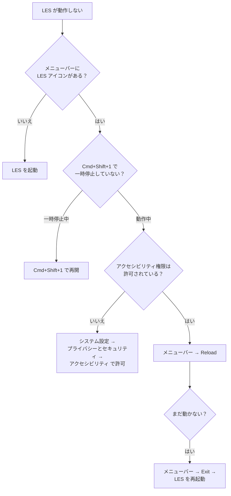

### プラグインメニューが表示されない

- ダブル右クリックの間隔が短すぎる/長すぎる場合があります
- `~/.les/menuconfig.ini` が存在するか確認
- メニューバーの **Reload** を実行

### プラグインが自動追加されない

- `settings.ini` で `autoadd=1` になっているか確認
- `loadspeed` の値を大きくする（HDD の場合は `0.5` 〜 `1.0`）
- Ableton Live のブラウザが表示されているか確認

### バージョン保存が動作しない

- `saveasnewver=1` になっているか確認
- プロジェクトが一度は保存されているか確認（未保存プロジェクトでは動作しません）

---

## イースターエッグ

`enabledebug=1` の状態で、**Shift キーを素早く2回タップ** するとチートメニューが表示されます。

以下のコマンドを入力できます：

| コマンド | 動作 |
|---------|------|
| `les` / `sweet` | LES ボイスサンプルを再生 |
| `303` / `sylenth` | デモ版メッセージを再生 |
| `fl studio` | FL Studio のサウンドを再生 |
| `collab bro` / `als` | レッスンプロジェクトを開く |
| `owo` / `uwu` | ??? |

---

## バージョン情報

| 項目 | 値 |
|------|-----|
| プログラム名 | Live Enhancement Suite Custom |
| バンドルID | org.les.Live-Enhancement-Suite-Custom |
| ベース | [LESforMacOS](https://github.com/LiveEnhancementSuite/LESforMacOS) のフォーク |
| ライセンス | MIT |
| バグ報告 | [GitHub Issues](https://github.com/bassmicrobe/LESforMacOSCustom/issues) |
